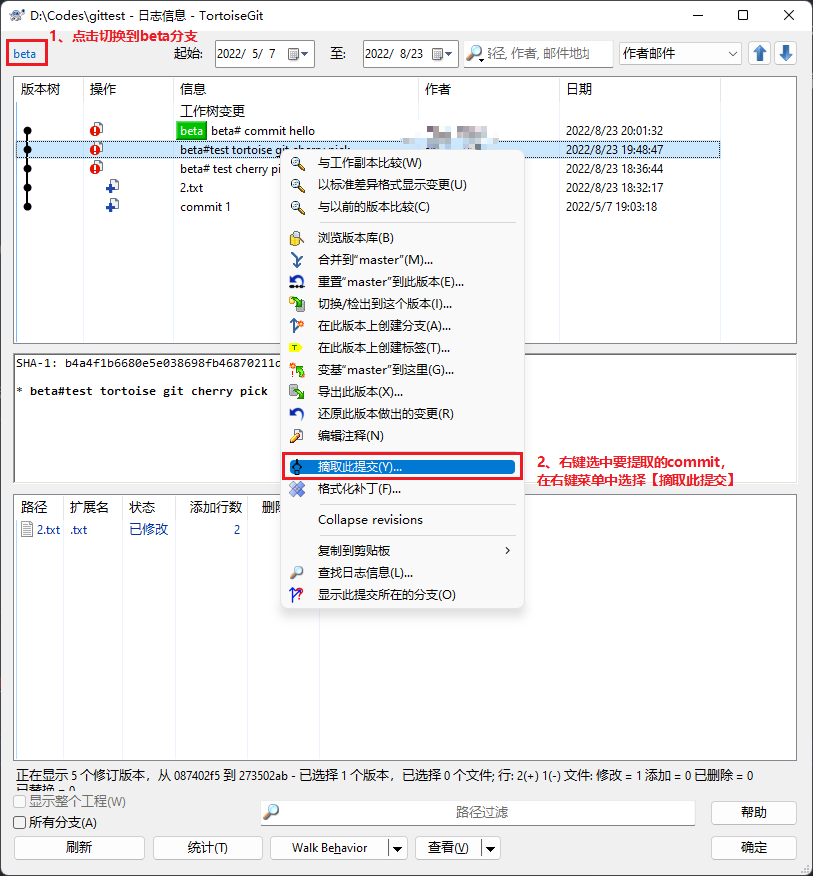
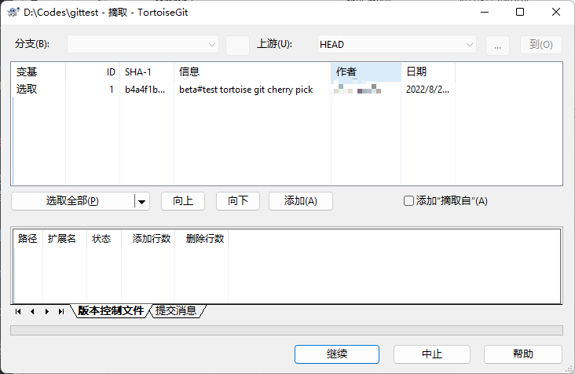

## 应用场景
在 A 分支上提交了一个 commit，B 分支也同样需要这个 commit 的代码，为了避免人工复制代码，可以用git的`cherry-pick`来实现合并指定commit。

假如有一个git 仓库，有 master 和 beta 两个分支，现在需要将 beta 分支的一个 commit 合并到 master 分支。接下来演示命令行操作命令和图形工具操作步骤。

## 命令行
```shell
# 切到 beta 分支
git checkout beta

# 查询要合并的commit id 并记录（假如commitid为 `45c14f6`）
git log --oneline

# 切换到master分支
git checkout master

# 合并commit到master分支
git cherry-pick 45c14f6

# 推送到远端
git push origin master
```

## TortoiseGit 操作

1. 切到要合并的分支(master)
2. 右键菜单，选择【显示日志】

    

3. 切到commit所在的分支(beta)，并提取commit

    

4. 在弹出的对话框中，点击【继续】

    

5. 点击【完成】后，推送即可