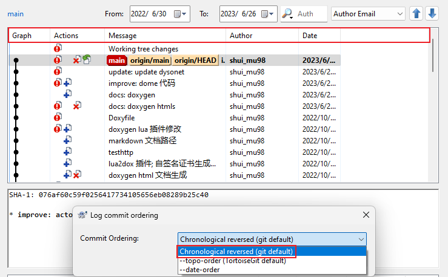

通常情况，使用 Git 图形工具或者 git log 命令查看提交日志时，默认显示当前分支上的提交，若要显示所有分支的提交记录，有以下几种方式：

1. Git GUI

    在菜单栏上，点击 **Repository -> Visualize All Branch History**

2. gitk 命令

    在 git bash 终端中，直接输入 `gitk --all`

3. git log 命令

    在 git bash 终端中，输入 `git log --graph --all`

4. 在 TortoisGit 中查看

    点击右键菜单的 **Show log**，在弹出来的日志框左下角勾选 **All Branches** 即可。

在使用 TortoisGit 查看提交历史时，默认的排序方式是 `--topo-order`，具体参考[文档](https://tortoisegit.org/docs/tortoisegit/tgit-dug-settings.html#tgit-dug-settings-look-feel)，里面有关于`--topo-order` 的解释：
>Normally log entries/commits are ordered in descending order of the commit date.`--topo-order` makes the commits appear in topological order (i.e. descendant commits are shown before their parents). Not using this option, might break the graph in the log dialog. However, this option is slower, because all log entries have to be processed before displaying them.

gitk 则使用 `Chronological revesed` 进行排序（推荐），TortoisGit 也可以更改默认排序规则，具体操作如下图所示：

