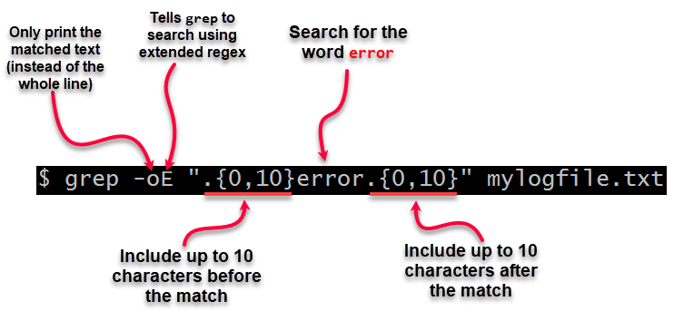
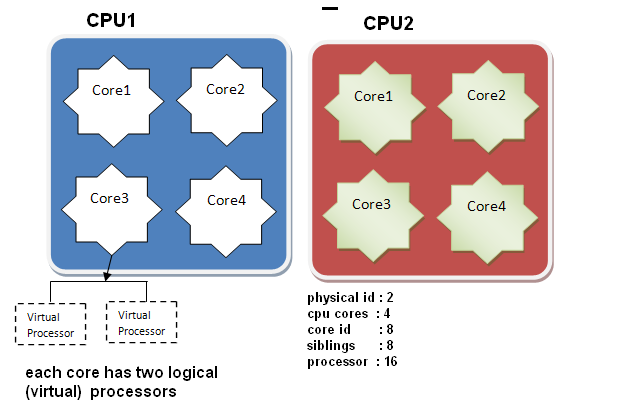

[TOC]

## date时间转换
- 时间转秒数
```
date -d "2012-11-12 13:00:00" +"%s"
```

- 秒数转时间
```
date -d@1352692800 +"%Y-%m-%d %H:%M:%S"
```

## 查看进程启动的精确时间
```
ps -eo pid,lstart,etime,cmd | grep nginx
```
查看 man 手册 (`man ps`)，可以看到 `lstart` 和 `etime` 的含义：
- `lstart` STARTED   time the command started. 即命令启动时间。
- `etime`  ELAPSED   elapsed time since the process was started, in the form [[DD-]hh:]mm:ss. 即从进程启动后流逝的时间。

参考：[Linux ps 命令查看进程启动及运行时间](https://www.cnblogs.com/weifeng1463/p/8807849.html)


## 截断grep返回的长匹配行
当使用grep 返回的匹配行过长，影响关键数据的查询，可以对匹配行进行截断，有两种方法：
- 方法一，使用 `-E` 参数，配合 `-o`参数。
```
#表示截取匹配到的行的关键词 BattleReport 前后10个字符，而不显示整行
grep -oE '.{0,10}BattleReport.{10}' xxx.log
```
截取方式入下图（图片引用字 stackoverflow）：


- 方法二，使用 `-P` 参数，即使用 perl 正则匹配，配合 `-o` 来达到截取效果。
```
grep -oP '.*(?=BattleReport)' xxx.log
```

perl 的四种表达式：
- `(?=...)`：表示从左向右的顺序环视。例如(?=\d)表示当前字符的右边是一个数字时就满足条件
- `(?!...)`：表示顺序环视的取反。如(?!\d)表示当前字符的右边不是一个数字时就满足条件
- `(?<=...)`：表示从右向左的逆序环视。例如(?<=\d)表示当前字符的左边是一个数字时就满足条件
- `(?<!...)`：表示逆序环视的取反。如(?<!\d)表示当前字符的左边不是一个数字时就满足条件

示例文件 test.log 内容如下：
```
email1=aaa@163.com
email2=bbb@qq.com
```

匹配输出结果：
```
grep -oP '.*(?=@163\.com)' test.log
# 输出：email1=aaa

grep -oP '(?=aaa).*' test.log
# 输出：aaa@163.com

grep -oP '.*(?<=aaa)' test.log
# 输出：email1=aaa

grep -oP '(?<=\=)(.+?)(?=@\d+\.com)'
# 输出：aaa
```
>小知识点，perl 默认使用贪婪匹配(greedy match)，若要使用懒惰匹配(lazy match)，则在 *，+，？等表示匹配次数的后面加上？就表示以懒惰模式进行匹配。

参考：
[How to truncate long matching lines returned by grep or ack](https://stackoverflow.com/questions/2034799/how-to-truncate-long-matching-lines-returned-by-grep-or-ack)、[grep 与 perl 正则 AWK](https://www.jianshu.com/p/dd5b97f9385a)、[linux grep命令的-P和-o选项的作用](https://www.cnblogs.com/onelikeone/p/16415452.html)


## 查看CPU信息
通过 `cat /proc/cpuinfo` 可以查看机器的CPU相关信息，包括：物理CPU个数、每个物理CPU的核心数、逻辑CPU数量。它们之间的关系如下图所示：


以下列出一些常用命令：
- 查看物理CPU个数：`cat /proc/cpuinfo |grep "physical id" |sort |uniq |wc -l`
- 查看每个物理CPU的核数：`cat /proc/cpuinfo| grep "cpu cores"| uniq`
- 查看逻辑CPU数：`cat /proc/cpuinfo| grep "processor"| wc -l`
- 查看CPU型号：`cat /proc/cpuinfo | grep name| cut -d: -f2|uniq`
>由于现代的CPU普遍都使用了超线程技术，因此在一个物理核心上可以有多个逻辑线程，比如：4核心8线程。

## Centos yum源配置
```
1. 进入yum源配置文件存放目录，编辑源配置文件
cd /etc/yum.repos.d/
vim xxx.repo

2. 删除原有的数据缓存
yum clean all

3. 重建数据缓存
yum makecache

4. 查看源列表
yum repolist

5. 查看已安装的包
yum list installed
```
若centos支持dnf，上面的命令可以用 dnf 替换 yum，例如：`dnf list installed`

## scp远程拷贝
- 拷贝单个文件：`scp xxx.zip root@192.168.1.100:/data/`
- 拷贝文件夹：`scp -r xxx root@192.168.1.100:/data/`

## 在tail中进行grep 多字符串匹配
使用 grep 对单文件进行多字符串的 AND 匹配时，一般使用类似下面的命令格式：
```bash
grep xxx filename.log | grep yyy
```
即匹配既存在 xxx 又存在 yyy 的行。

但是这种方式在匹配 `tail -f filename.log` 的输出时会出现问题，只支持一个管道。例如下面格式的命令就不会生效：
```bash
tail -f filename.log | grep xxx | grep yyy
```
大概的原因是：管道`|`是全缓冲的，一般来说buffer_size为4096，有些是8192。不管具体值多少，只有buffer_size满了，才会看到输出。

可以使用 `-e` 参数来解决问题：
>-e PATTERNS, --regexp=PATTERNS. Use PATTERNS as the patterns. If this option is used multiple times or is combined with the -f (--file) option, search for all patterns given.  This option can be used to protect a pattern beginning with “-”.

命令格式如下：
```bash
tail -f filename.log |grep -e "xxx" -e "yyy"
```

## xargs 妙用
xargs 通常用于给其他命令传递参数，一些常用组合例子如下：
- 配合 `ls` 和 `tail` 查询多个日志文件
```bash
# 查询文件夹内多个skynet进程的日志文件
# a/log/skynet.log
# b/log/skynet.log
# c/log/skynet.log
ls | xargs -I {} tail -v {}/log/skynet.log
```

- Kill 掉多个同名进程
```bash
pgrep -laf skynet | awk '{print $1}' | xargs kill
```

- 配合 `grep` 查询文件内容
```bash
ls | xargs -I {} grep -Hn "cluster_ip" {}/config/skynet.config
```

## 输出重定向到dev/null
### 伪设备
- `/dev/null` - 接受并丢弃所有输入; 不产生输出（总是在读取时返回文件结束指示）
- `/dev/zero` - 接受并丢弃所有输入; 产生连续的NUL（零值）字节流
- `/dev/full` - 读取时产生连续的NUL（零值）字节流，并在写入时返回“磁盘已满”消息
- `/dev/random`和`/dev/urandom` - 它们产生的一个可变长度的数据流的伪随机数

### 文件描述符
| 名称              | 文件描述符 | 缩写   | 设备  |
| :-----------------| :----------| :------| :-----|
|标准输入           | 0          | stdin  | 键盘  |
|标准输出           | 1          | stdout | 屏幕  |
|标准错误输出       | 2          | stderr | 屏幕  |

`command > /dev/null 2>&1` 表示执行某个命令不会产生任何日志输出，它等同于 `command 1>/dev/null 2>&1`，即先将命令的标准输出重定向到 `dev/null`，然后把标准错误输出重定向到标准输出，**注意：`2>&1`必须要在最后**。

若 `2>&1` 写在前面，即`command 2>&1 >/dev/null`，表示先将错误输出重定向到标准输出(屏幕)，然后再将标准输出重定向到 `dev/null`。

| 命令              | 标准输出 | 错误输出 |
| :-----------------| :--------| :--------|
| `>/dev/null 2>&1` | 丢弃     | 丢弃     |
| `2>&1 >/dev/null` | 丢弃     | 屏幕     |


## jq 对keys和values的排序处理
jq 1.3 与 之后的版本对排序的处理不同。
参考:[jq sorts KEY and VALUES in different way - how can I enumerate them in the same order?](https://stackoverflow.com/a/42324565)

```
# 使用的jq版本为1.6
# keys 按字母顺序排序
echo '{"a":1, "c":3, "b":2}' |jq "keys[]"

# keys 按输入顺序排序
echo '{"a":1, "c":3, "b":2}' |jq "keys_unsorted[]"
```

## 一键下载并解压
```bash
# 使用 wget 下载并解压
# -O 表示把下载数据写入到指定文件,例如： -O sds.tar.gz
# -O -，-表示把下载输入写入到标准输出
wget https://github.com/antirez/sds/archive/refs/tags/2.0.0.tar.gz -O - | tar -zxv

# 使用 curl 下载并解压
# -L，自动重定向url
# -#，显示下载进度条
curl -L https://github.com/antirez/sds/archive/refs/tags/2.0.0.tar.gz -# |tar -zxv

# 解压到指定目录
mkdir -p aaa && wget https://github.com/antirez/sds/archive/refs/tags/2.0.0.tar.gz -O - | tar -zxv -C aaa
#解压后目录结构
#tree aaa
#aaa
#└── sds-2.0.0
#    ├── Changelog
#    ├── LICENSE
#    ├── Makefile
#    ├── README.md
#    ├── sds.c
#    ├── sds.h
#    ├── sdsalloc.h
#    └── testhelp.h

# 解压到指定目录，并去除第一层目录
mkdir -p aaa && wget https://github.com/antirez/sds/archive/refs/tags/2.0.0.tar.gz -O - | tar -zxv --strip-components 1 -C aaa
#解压后目录结构
#tree aaa
#aaa
#├── Changelog
#├── LICENSE
#├── Makefile
#├── README.md
#├── sds.c
#├── sds.h
#├── sdsalloc.h
#└── testhelp.h
```

## 删除软连接
- 使用unlink（**推荐**）
    ```bash
    #将 /data/test 软连接到 aaa
    link -s aaa /data/test

    # 删除 aaa 软连接
    unlink aaa
    ```

- 使用rm(**强烈不推荐**)
    注意：千万不要带 `-rf`参数和`/`后缀，例如：`rm -rf aaa/`，这样会把源文件夹的内容都删除掉，而不会删除软连接。
    ```bash
    # 删除aaa软连接，不需要带 -r -f 参数，因为aaa是一个软连接文件类型
    # 可以通过 file aaa 来查看文件类型
    file aaa

    rm aaa
    ```

## 查看文件的指定行
```bash
# 查看 5至10行的内容
sed -n "5,10p" xxx.log

# 查看第 5 行的内容
sed -n "5,5p" xxx.log
```
