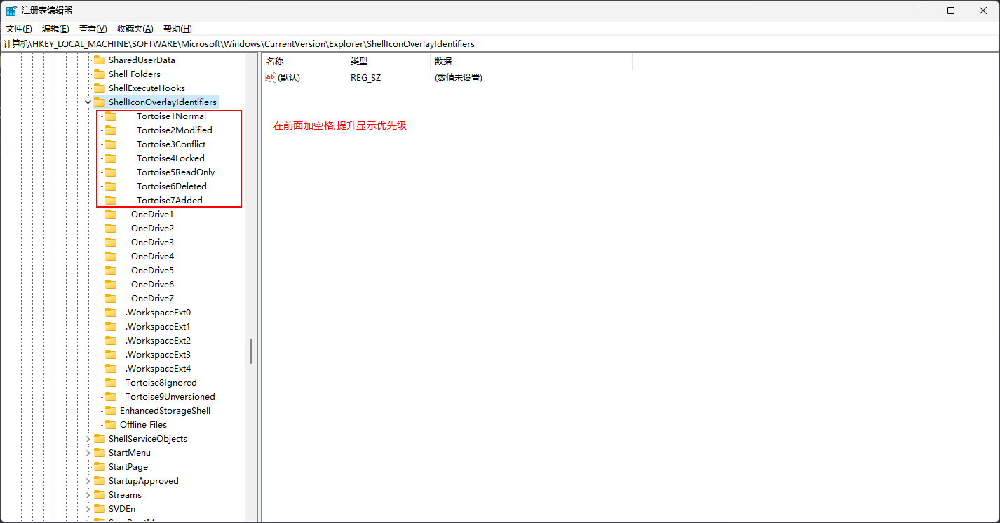

Windows 的外壳图标(shell icon) 有 15 个的数量上限，详细原因参见[Why is there a limit of 15 shell icon overlays?](https://devblogs.microsoft.com/oldnewthing/20190313-00/?p=101094)，都是一些历史包袱。

通过修改注册表来修复显示问题，注册表项如下：
```
计算机\HKEY_LOCAL_MACHINE\SOFTWARE\Microsoft\Windows\CurrentVersion\Explorer\ShellIconOverlayIdentifiers
```

可以通过在前面加空格的方式提升 shell icon 优先级，修改完后**重启电脑或者重启资源管理器**即可生效。

重启资源管理器，用管理员方式打开 CMD， 输入：
```bash
taskkill /f /im explorer.exe
start explorer.exe
```

