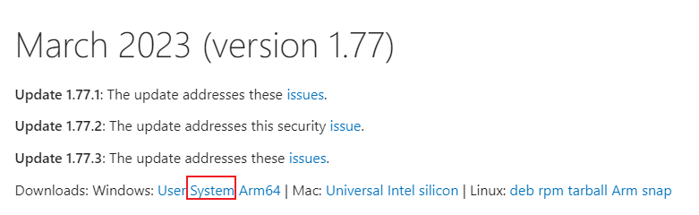
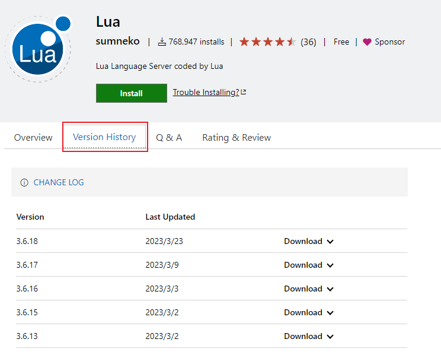

## 不显示检查更新

此问题出现在 `1.70.0` 版本之后，参见 [issue](https://github.com/microsoft/vscode/issues/157383)。

Vscode 分为了两个版本：

-   系统类型安装(system setup)，安装包名形如：VSCodeSetup-x64-1.75.1.exe
-   用户类型安装(user setup)，安装包名形如：VSCodeUserSetup-x64-1.75.1.exe

官网默认下载**用户类型**的安装包，如需要下载系统类型的安装包，可以进入[Updates](https://code.visualstudio.com/updates)页面选择 _System_ 版本下载。



## 离线下载指定版本插件

在插件市场上只会显示最近 5 个版本的插件下载链接，以 [lua 插件](https://marketplace.visualstudio.com/items?itemName=sumneko.lua)为例，如下图所示：



如果要下载更早版本的插件，可以找到一个可以下载的版本，获取到它的下载地址，然后替换版本号即可，例如下载 `3.6.11` 版本的 lua 插件。

```
https://marketplace.visualstudio.com/_apis/public/gallery/publishers/sumneko/vsextensions/lua/3.6.11/vspackage?targetPlatform=linux-x64
```

## Git 推送报错"Missing or invalid credentials"

1. 确保设置`"git.terminalAuthentication"` 是否为 false;
2. 若上面设置正确，则修改仓库的 `.git/config` url 地址为带用户名和密码的形式，如：

```ini
[remote "origin"]
        url = https://用户名:密码@github.com/xxx/xxx.git
        fetch = +refs/heads/*:refs/remotes/origin/*
```
